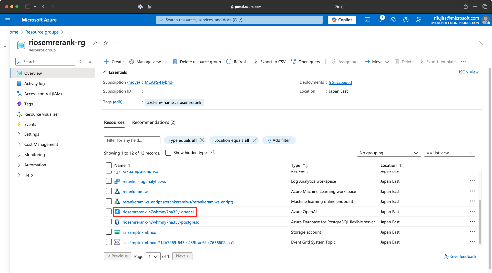
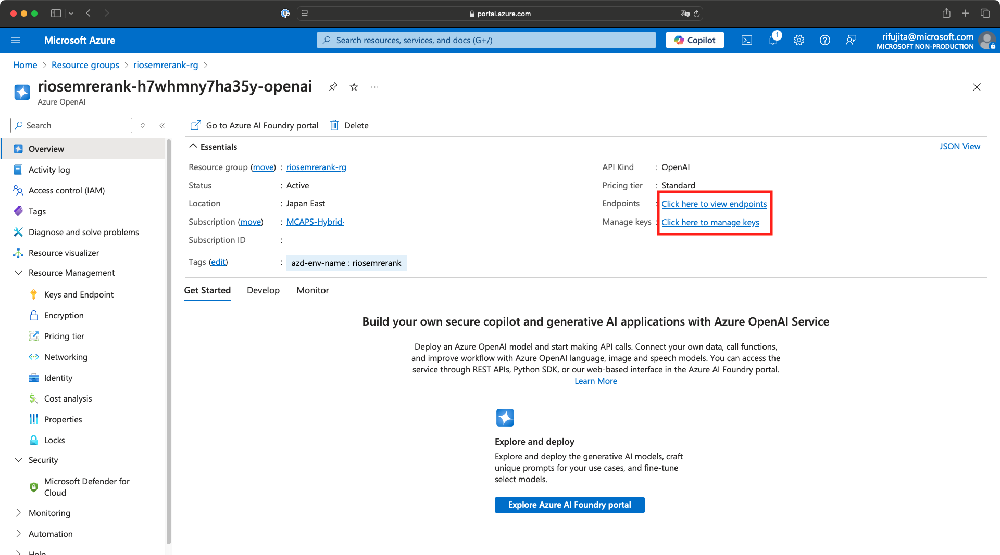
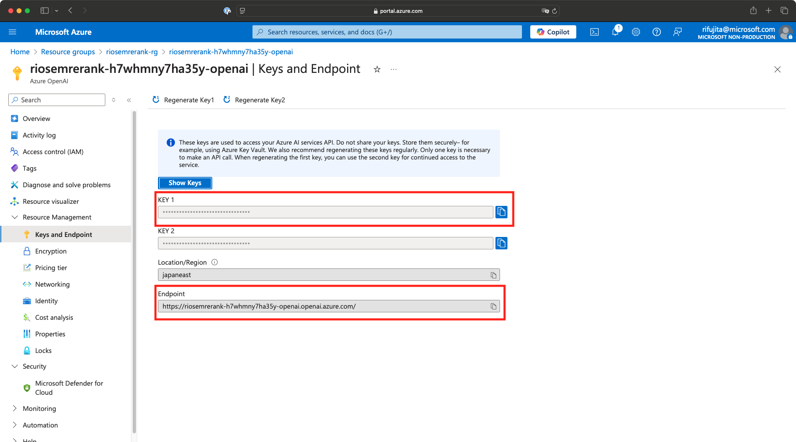
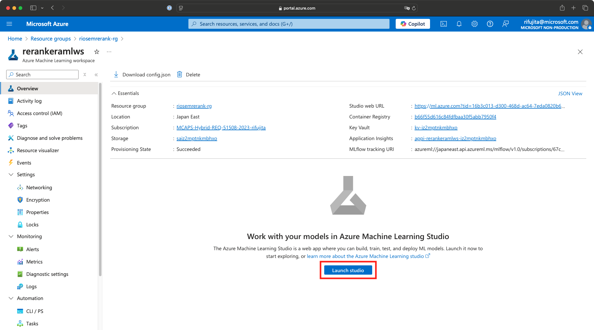
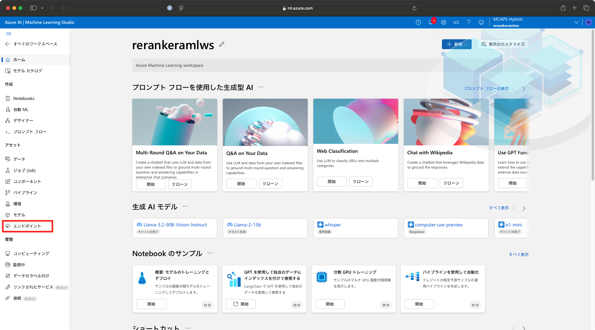
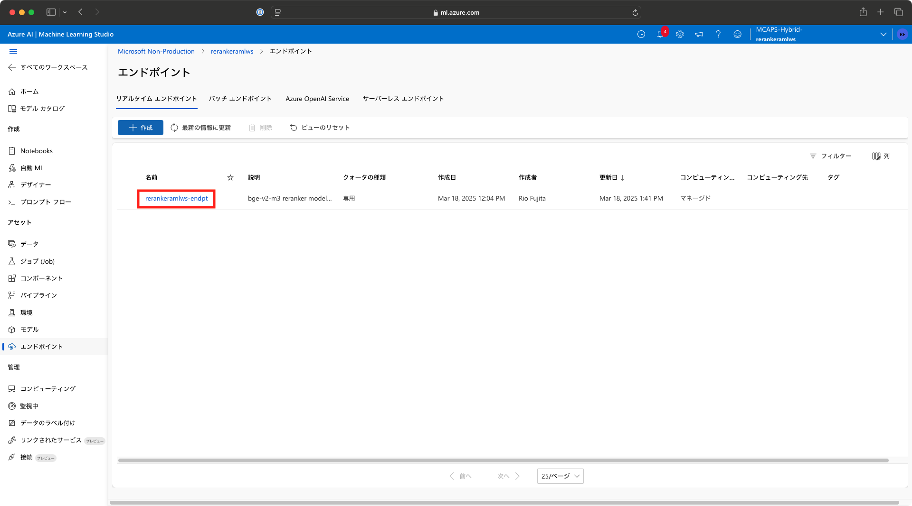
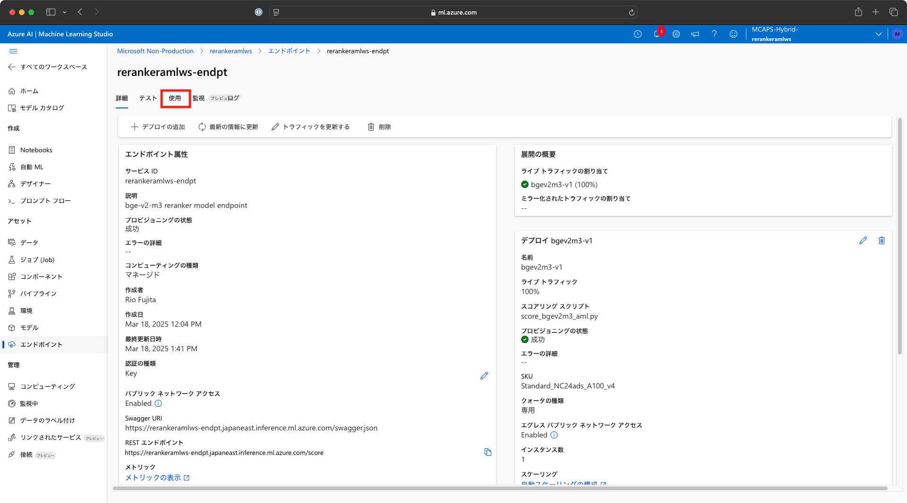
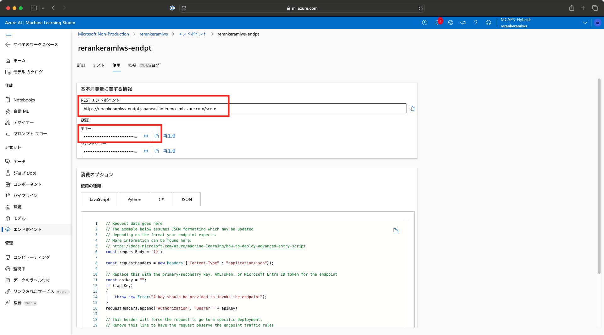

## Azure Database for PostgreSQL Flexible Server における セマンティックランキング

情報検索パイプラインの精度は、高度な Retrieval Augmented Generation (RAG) アプリケーションの品質において重要な役割を果たします。
Semantic Ranker Solution Accelerator を使用すると、Azure Database for PostgreSQL に セマンティックランカーモデル を拡張し、PostgreSQL の SQL クエリ内で直接利用することで、ベクター検索結果の精度を向上させることができます。
このソリューションアクセラレーターには、以下の機能が含まれています：
* 自動デプロイメントスクリプト により、セマンティックランカーモデルを Azure Machine Learning Inference Endpoint としてプロビジョニング
* PostgreSQL の SQL UDF（ユーザー定義関数） により、SQL クエリ内でランカーモデルを統合

このソリューションアクセラレーターを使用するには、[azure_ai](https://learn.microsoft.com/en-us/azure/postgresql/flexible-server/generative-ai-azure-overview) 拡張機能が必要です。

## セマンティックランカーソリューションのデモについて

私たちのソリューションアクセラレーターのデモでは、CNN-DailyMail データセットのサブセットを活用しています。このデータセットには、ジャーナリストによって執筆されたニュース記事が含まれています。
デモのプロセスは以下のように構成されています:

   1. 埋め込みとインデックス作成: まず、記事を埋め込み（Embedding）し、生成されたベクトルを Hierarchical Navigable Small World (HNSW) アルゴリズム を使用してインデックス化します。このステップにより、効率的かつスケーラブルなベクター検索機能が確保されます。
   2. クエリ処理: クエリを受信すると、そのクエリを埋め込み（Embedding）し、ベクター検索を通じて N 個の最も近いベクトル を取得します。これにより、最も関連性の高い記事を迅速に特定できます。
   3. セマンティックリランキング: 取得したベクトルを セマンティックランカーモデル に渡します。このモデルは、ベクトルの意味的関連性に基づいて順序を再評価し、上位 K 件の結果を返します。これにより、最も関連性の高い記事が優先的に表示されるようになります。

## 始める前に

* Azure サブスクリプションが必要です。
* [Azure Developer CLI](https://learn.microsoft.com/en-us/azure/developer/azure-developer-cli/install-azd?tabs=winget-windows%2Cbrew-mac%2Cscript-linux&pivots=os-linux)のインストール
* [Azure CLI](https://learn.microsoft.com/en-us/cli/azure/install-azure-cli) のインストール
* `az extension add --name ml` による az ml 拡張機能のインストール
* デプロイするリージョンに十分な コンピュートクォータ が利用可能であることを確認してください。必要なクォータは Standard_NC24ads_A100_v4 の 24 CPU です。
[Azure Machine Learningのクォータの要求方法](how_to_request_quota_jp.md)
([Azure Machine Learning を使用するリソースのクォータと制限の管理と引き上げ](https://learn.microsoft.com/ja-jp/azure/machine-learning/how-to-manage-quotas?view=azureml-api-2))

## デモ環境の作成

このデモでは、Bicep ファイル を使用して必要なリソースをデプロイします。以下の手順に従って、このデモを完了するために必要な Azure サービス を Azure サブスクリプション にデプロイしてください。

1. 以下のコマンドを入力して、演習リソースを含む GitHub リポジトリをクローンします:

    ```bash
    git clone https://github.com/microsoft/Semantic-Ranker-Solution-PostgreSQL.git
    cd Semantic-Ranker-Solution-PostgreSQL
    ```

2. Azure アカウントにログインします
    ```bash
    azd auth login
    ```

3. 新しい `azd` 環境を作成します

   ```bash
    azd env new
    ```

   リソースグループに使用する名前を入力してください。これにより、`.azure` フォルダー内に新しいフォルダーが作成され、以降の `azd` コマンドの呼び出しで アクティブな環境 として設定されます。

4. リソースのプロビジョニング

    ```bash
    azd up
    ```

    これにより、Azure Database for PostgreSQL Flexible Server、Azure OpenAI サービス、および Azure Machine Learning Workspace を含む Azure リソース がプロビジョニングされ、このサンプルがそれらのリソースにデプロイされます。

5. リランカーモデルのデプロイ

   ```bash
   bash deploy_model.sh
   ```

   これにより、Hugging Face から リランカーモデル をダウンロードし、Azure Machine Learning Workspace にデプロイします。

## アクセス情報の取得

6. Azure OpenAIのアクセス情報を取得する

  [Azureポータル](https://portal.azure.com/)にアクセスし、作成されたリソースグループのリストから Azure OpenAI をポイントします。
  

  左のブレードの[概要(Overview)]から、エンドポイントもしくはマネージキーをポイントします。
  

  表示されたエンドポイントとキーをコピーし、テキストエディタなどで一時的に保存します。
  

7. Azure Machine Learningのアクセス情報を取得する

  Azure OpenAIと同様に、リソースグループのリストから Azure Machine Learning workspace をポイントし、[Lauch Studio]をクリックします。
  

  左のブレードから[エンドポイント]をクリックします。
  

  リアルタイムエンドポイントのリストから、作成したエンドポイントをポイントします。
  

  [使用]タブに切り替えます。
  

  表示されたエンドポイントとキーをコピーし、テキストエディタなどで一時的に保存します。
  

## Azure Database for PostgreSQL Flexible Server におけるセマンティックリランキング

8. データベースのホスト名、ユーザー名、およびデータベース名を指定して、データベースに接続します

    ```bash
    # azd 環境から環境変数を読み込む
    source <(azd env get-values)
    # PostgreSQL に接続
    psql --host=$AZURE_POSTGRES_HOST --port=5432 --username=$AZURE_POSTGRES_USERNAME --dbname=$AZURE_POSTGRES_DB_NAME
    ```

    もし上記のコマンドが失敗する場合は、以下を試してください:
    ```bash
    azd env get-values | awk '{print "export " $0}' > azd_env
    source azd_env
    psql --host=$AZURE_POSTGRES_HOST --port=5432 --username=$AZURE_POSTGRES_USERNAME --dbname=$AZURE_POSTGRES_DB_NAME
    ```

9. 必要な拡張機能を作成しセットアップする

    ```sql
    \i setup_azure_ai.sql
    ```

   OpenAI エンドポイント と サブスクリプションキー、および Azure Machine Learning のスコアリングエンドポイント と キー（デプロイ済みの埋め込みモデルおよびリランカーモデル用）を入力するよう求められます。
   手順6・7で保存した項目をそれぞれ入力します。

10. デモの実行

    ```sql
    \i semantic_reranker_demo.sql
    ```

    ベクター検索とリランキングの後、「人工知能に関する最新ニュース」 というクエリに対して、上位 3 件の記事 とその 関連性スコア を返します。

## 再デプロイ時の注意点

`azd down` を実行することでデプロイされたリソースは削除されますが、下記2点について注意が必要です。

削除したAzure AIリソースを48時間以内に同じ名称で再度デプロイするには、削除したリソースを消去する必要があります。
[削除された Azure AI サービス リソースの復旧または消去](https://learn.microsoft.com/ja-jp/azure/ai-services/recover-purge-resources?tabs=azure-portal)

同様にAzure MLリソースは14日間保持されるようになっているため、同じ名称で再度デプロイするには、ワークスペースを完全に削除する必要があります。
[論理的な削除中のワークスペース データを回復する](https://learn.microsoft.com/ja-jp/azure/machine-learning/concept-soft-delete?view=azureml-api-2)
