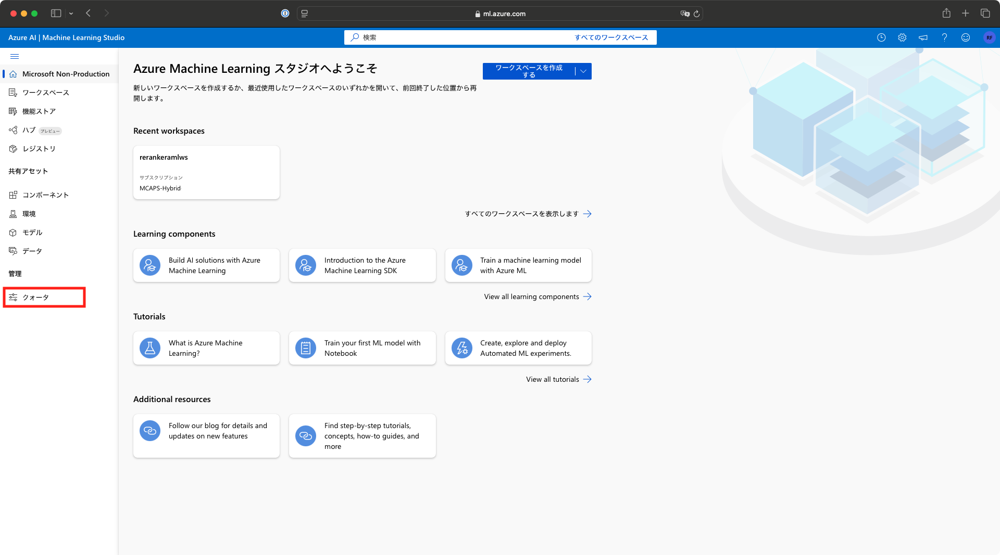
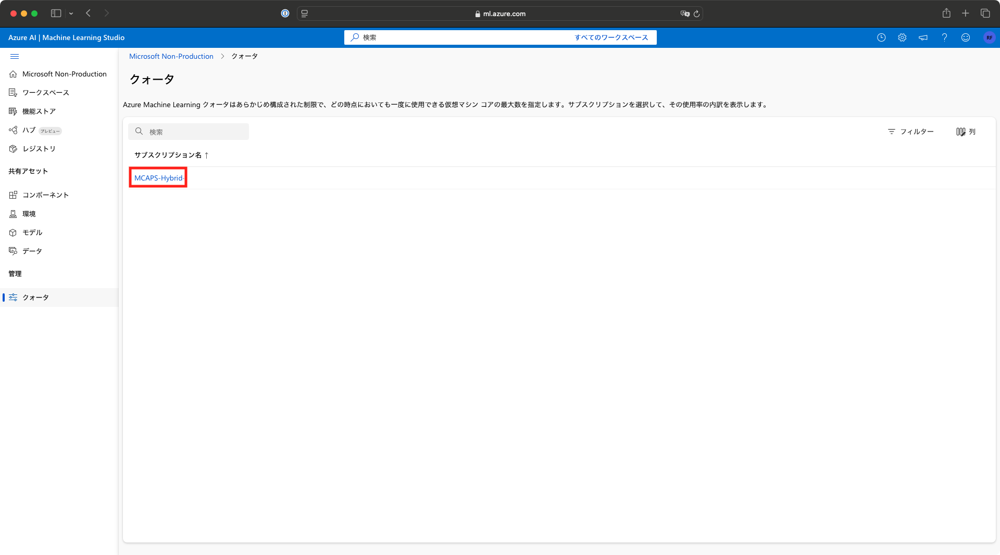
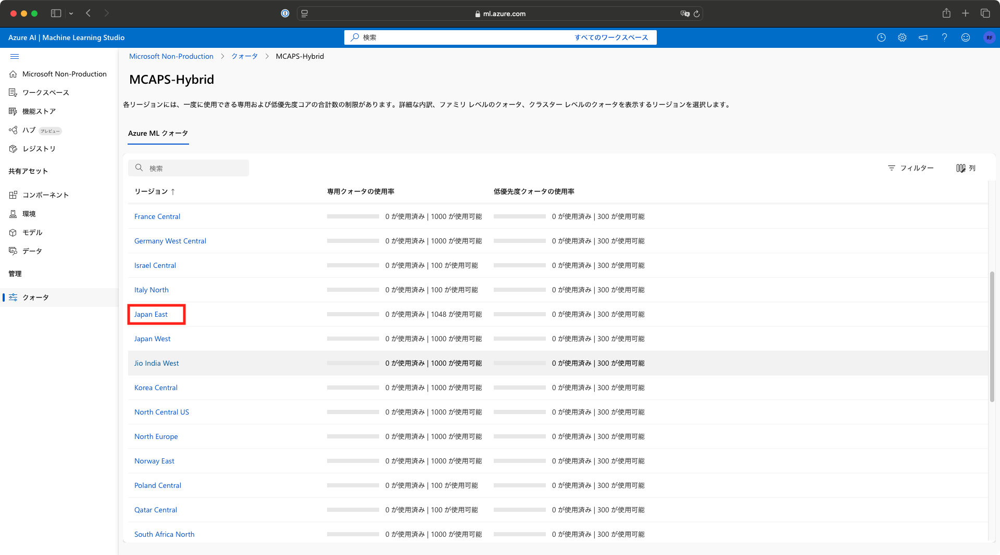
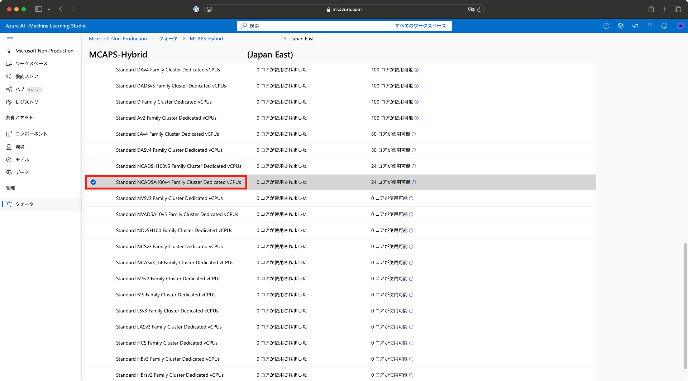
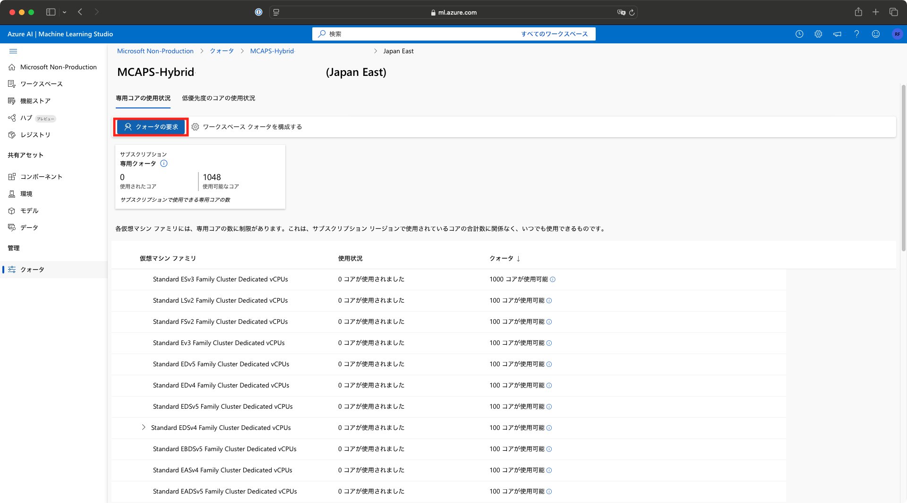
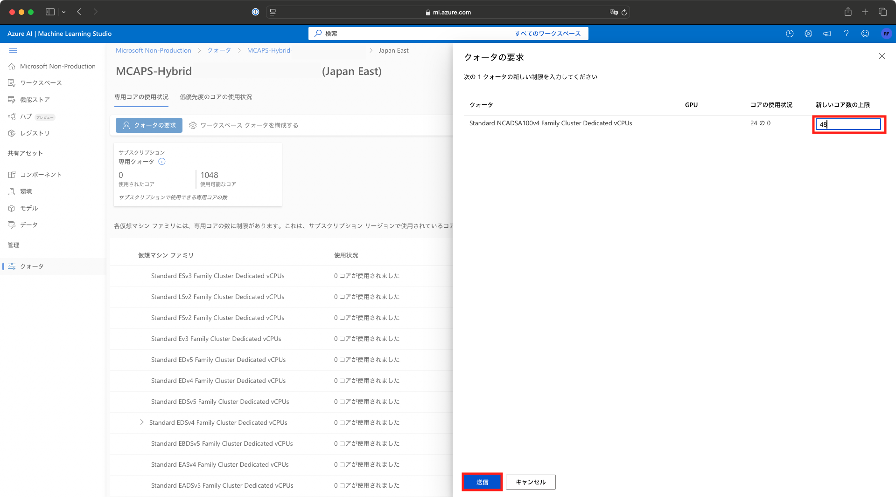

# Azure Machine Learningのクォータの要求方法

1. [Azure Machine Learningスタジオ](https://ml.azure.com/)をブラウザで開き、左のブレードから[クォータ]をクリックします。

2. [クォータ]画面でクォータを変更するサブスクリプションをクリックします。

3. クォータを変更するAzureリージョン名をクリックします。

4. [仮想マシンファミリ]のリストから、[Standard NCADSA100v4 Family Cluster Dedicated vCPUs]を選択します。

5. リストの最上部に戻り、[クォータの要求]ボタンをクリックします。

6. [新しいコア数の上限]に"24"あるいはそれ以上の数字を入力し、[送信]ボタンをクリックします。

リクエスト内容の審査後、クォータが変更されるまで数営業日を要することがあるので、
本ソリューションアクセラレータのデプロイ前に余裕を持ってリクエストを送信してください。

参考: [Azure Machine Learning を使用するリソースのクォータと制限の管理と引き上げ](https://learn.microsoft.com/ja-jp/azure/machine-learning/how-to-manage-quotas?view=azureml-api-2)
